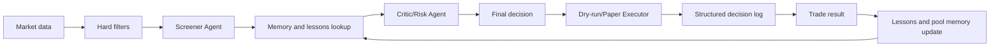

# Riflow Beta

Paper trading CLI for Meteora DLMM pools with AI-driven screening, risk management, and adaptive memory.

Riflow is terminal-first and paper-only. It supports multiple AI providers, adaptive model memory, performance coaching, hard filters, critic review, structured decision logs, pool memory, and dry-run-first execution.

> Current status: paper trading and dry-run simulation only.
>
> Live trading is not implemented. No real orders are sent and no real funds are used.

## Architecture




Agent roles:

- **Screener Agent** finds and scores pool/token opportunities after mechanical filters.
- **Manager Agent** monitors active positions and decides hold, claim, close, or redeploy using deterministic safety rules.
- **Critic/Risk Agent** reviews Screener/Manager decisions before execution.
- **General Agent** handles user commands, status, logs, and manual interaction.

## Safety Model

`DRY_RUN=true` is the default. In dry-run mode, Riflow simulates deploy, close, and claim actions, still writes structured decision logs, and does not mutate live execution state.

Important config sections live in `data/config.json` and are added with backward-compatible defaults:

- `safety`: `dryRun`, `paused`, `emergencyPause`
- `screening`: min/max TVL, volume, holders, organic score, bin step, top-holder concentration, blacklist, warning filters
- `sizing`: gas reserve, min/max deploy, default risk percentage, max exposure per token/pool
- `management`: claim threshold, out-of-range duration, stop loss, take profit, trailing take profit, minimum position age

Dynamic sizing:

```text
deploy amount = (paper balance - gas reserve) * default risk percentage
```

Then Riflow clamps by min/max deploy size and max token/pool exposure.

## Hard Filters

Before AI sees candidates, Riflow mechanically filters by:

- minimum TVL
- maximum TVL
- minimum volume
- minimum holders
- minimum organic score
- allowed bin step range
- maximum top-holder concentration
- token warning and blacklist checks
- unsafe/scam metadata flags

Token metadata, pool names, descriptions, websites, and socials are treated as untrusted data. Prompt rules explicitly forbid following instructions from token metadata.

## Real Meteora Dummy Mode

Riflow can use real active Meteora DLMM pool data while staying paper-only. This does not require a private key and never sends transactions.

Enable it in `data/config.json`:

```json
{
  "scanner": {
    "source": "meteora-dlmm",
    "meteoraApiUrl": "",
    "limit": 12,
    "refreshSeconds": 30
  }
}
```

Default public source:

```text
https://pool-discovery-api.datapi.meteora.ag
```

Optional env values:

```bash
RIFLOW_RPC_URL=https://mainnet.helius-rpc.com/?api-key=your_helius_api_key_here
RIFLOW_METEORA_API_URL=
```

The Helius RPC URL is optional for future enrichment. Current Meteora dummy mode works from public pool APIs and does not need `WALLET_PRIVATE_KEY`.

Commands:

```bash
npm run check
npm start
node src/cli.js meteora-scan
node src/cli.js dummy-run --source meteora-dlmm --rounds 3 --interval 30s
node src/cli.js dummy-run --source meteora-dlmm --duration 60m --interval 5m
node src/cli.js dummy-report
node src/cli.js daemon --source meteora-dlmm --interval 5m
node src/cli.js daemon --source meteora-dlmm --interval 5m --single-position --ai-timeout 120s
node src/cli.js daemon-status
```

Recommended interactive workflow:

```bash
npm start
```

Then use:

1. `Trading setup` to choose interval, single-position mode, force-entry test mode, TP/SL, minimum hold, out-of-range handling, candidate score, max positions, and DLMM range mode.
2. `Start paper daemon` to run the saved paper daemon settings.
3. `Daemon status`, `dummy-report`, `positions`, and `logs` to inspect performance.

Useful daemon options:

- `--single-position` skips new-entry AI calls while a paper position is already open, then keeps running manager checks.
- `--ai-timeout 120s` gives slower AI providers/proxies more time before marking the decision as unavailable.
- `--relaxed` relaxes hard filters for paper experiments only.
- `--force-entry` forces a paper entry into the top hard-filtered candidate for testing only.

Paper PnL is approximate until exact DLMM LP math is implemented:

- price PnL compares current pool price to entry price
- estimated fees use active TVL when available: `fees24hUsd / 24 * positionShare * elapsedHours`
- `positionShare = paper position USD value / current active TVL`, falling back to total TVL
- out-of-range positions accrue little or no estimated fees
- logs include `calculationMode: "approximate-dlmm"`

## DLMM Strategy Logic

Riflow now scores Meteora candidates deterministically before AI sees them. The score includes TVL, active TVL, volume, fees, fee/TVL, fee/active-TVL, holder quality, organic score, top-holder concentration, LP/trader activity, growth, bin step, volatility, mint/freeze authority, warnings, and pool memory.

Each candidate gets:

```text
candidateScore, qualityLabel, rejectReasons, positiveSignals, riskSignals
```

Entry gates block pools that fail hard filters, score below `strategy.minCandidateScore`, are in cooldown, are already open, exceed max exposure, lack balance, or violate max position limits.

Paper positions store a DLMM-style range:

```text
rangeMode, lowerPrice, upperPrice, lowerBin, upperBin, rangeWidthPct
```

The manager applies deterministic rules before AI reasoning:

- minimum hold time
- emergency stop loss
- stop loss
- take profit
- trailing take profit
- fee claim threshold
- out-of-range close/redeploy
- TVL/volume/fee collapse
- token warning downgrade
- cooldown after close

If the Meteora API is unavailable, Riflow falls back to `local-sim` and writes a warning in filtered candidates/logs.

## Adaptive Memory

Every AI trader has its own local memory:

```text
memory/mimo.json
memory/gemini.json
memory/openai.json
memory/claude.json
```

Memory stores lessons, avoid patterns, preferred patterns, confidence adjustments, risk improvements, timestamps, and performance snapshots. Models do not permanently learn; Riflow injects local memory into future prompts.

Pool/token memory lives in:

```text
memory/pools.json
memory/lessons.json
```

Pool memory tracks past decisions, past PnL, fee performance, out-of-range behavior, risk flags, AI notes, and lessons learned.

## Performance Coach

The coach reviews recent closed paper trades and AI decisions, then consolidates memory:

```bash
riflow coach mimo --last 7d
riflow coach mimo --trades 50
riflow memory show mimo
```

Lessons from closed positions include entry reason, exit reason, duration, initial metrics, final PnL, fee earned, what worked, what failed, and whether similar setups should be preferred or avoided.

## Commands

Core:

```bash
riflow status
riflow scan
riflow meteora-scan
riflow screen
riflow manage
riflow dummy-run --source meteora-dlmm --rounds 3 --interval 30s
riflow dummy-report
riflow trading-setup
riflow start-daemon
riflow daemon --source meteora-dlmm --interval 5m
riflow daemon --source meteora-dlmm --interval 5m --single-position --ai-timeout 120s
riflow daemon-status
riflow candidates
riflow positions
riflow pnl
riflow watch
```

Manual paper/dry-run actions:

```bash
riflow open FLOW 0.25
riflow close pos_...
riflow claim pos_...
riflow dry-run on
riflow dry-run off
riflow pause
riflow resume
```

Reset paper/dummy test data while preserving config, providers, API keys, and `.env`:

```bash
riflow reset paper --yes
riflow reset memory --yes
riflow reset logs --yes
riflow reset all --yes
```

Stop the daemon before resetting, otherwise Riflow refuses the reset to avoid state races.

AI providers and evaluation:

```bash
riflow providers
riflow select-provider
riflow test-provider
riflow add-provider
riflow use mimo
riflow leaderboard
riflow stats mimo
riflow battle --models mimo,mimo-fast --rounds 10
```

Memory and audit:

```bash
riflow memory show mimo
riflow memory reset mimo
riflow memory export mimo
riflow memory import mimo ./memory.json
riflow lessons
riflow logs
riflow decision-logs
```

## Decision Logs

Structured JSONL logs are written to:

```text
logs/decisions.jsonl
```

Each entry includes timestamp, dry-run flag, agent name, action type, pool/token, input metrics, memory used, reasoning summary, confidence score, risk notes, final decision, execution result, and PnL/fee results when available.

## Project Layout

- `src/agents`: Screener, Manager, Critic/Risk, and General role boundaries
- `src/core`: context, risk math, sizing
- `src/io`: JSON store, event log, structured decision log
- `src/prompts`: shared trader, coach, and memory prompt builders
- `src/services`: scanner, hard filters, portfolio, provider logic, coach, pool memory, lessons
- `src/ui`: terminal rendering
- `memory`: model-specific and pool-specific memory
- `logs`: event and decision logs

## Philosophy

Riflow's center of gravity is model competition plus AI-to-memory-to-AI reasoning. The system learns through stored lessons and structured reflection while deterministic rules keep execution conservative.

## License

MIT
